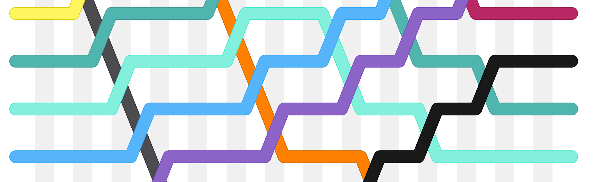

# PeachMirrorCODERA - An Extendable Framework for Transparency and Access

Lorem ipsum dolor sit amet, consectetur adipiscing elit. Nullam faucibus mi magna, id pretium urna hendrerit non. Pellentesque venenatis neque a pulvinar ultrices. Fusce dui justo, condimentum et cursus nec, porttitor id libero. Sed et libero vitae lorem auctor dictum. Etiam iaculis eu turpis sed cursus. In elit risus, condimentum sit amet velit a, iaculis accumsan massa. Nam non venenatis metus. Nulla tincidunt et purus non posuere. Phasellus malesuada eleifend elit, at blandit nisi finibus et.

## Scelerisque sagitti

Fusce id nunc rutrum, vulputate ipsum nec, lobortis metus. Sed scelerisque sagittis magna, ut tincidunt libero rhoncus ut. Phasellus ut dolor vel magna tristique facilisis vitae at leo.
1. **Duis** sit amet venenatis turpis, id vulputate magna. 
2. **Duis sed** semper tortor, sed placerat massa.
3. Vivamus sit amet **mollis ligula**, sed eleifend ex.
4. **Vestibulum** sed commodo augue.
5. Vivamus posuere velit eu enim aliquam, in consectetur **massa blandit**.
6. _Bonus_: **Phasellus id nunc lorem.**

Proin ut tincidunt orci. Sed quis accumsan massa. Vivamus mauris nisi, consequat at efficitur id, tempor sit amet risus.

## Magna tristique

Pellentesque feugiat, nunc ut facilisis scelerisque, metus elit euismod ligula, at maximus libero tortor et odio. Suspendisse faucibus iaculis euismod. Nullam egestas diam felis, id pharetra libero vulputate at. Praesent malesuada nisi nunc, eget dignissim enim malesuada ac. Nulla tristique neque non libero mattis sollicitudin. Morbi eleifend tincidunt libero, eget blandit ipsum dignissim in. Donec vehicula vel mi in semper. Pellentesque quis fermentum enim. Donec fringilla tortor id auctor ultrices. Aliquam euismod lacus dui, ut rhoncus elit ullamcorper sit amet.


Abbildung 1: Vivamus mauris nisi, consequat at efficitur id, tempor sit amet risus.


Cras luctus mi vitae odio eleifend, at tristique magna convallis. Sed quis mauris vulputate, mollis arcu sit amet, euismod est. Pellentesque dictum diam quam, varius gravida augue porttitor vitae. Nullam ex mauris, tristique et ipsum vitae, semper ullamcorper quam. Proin vehicula arcu sed metus efficitur, non ultrices ante blandit. Suspendisse leo nisi, pulvinar nec ultrices quis, mollis non felis. Aliquam non purus ornare, vulputate nisi accumsan, sollicitudin lacus. Nulla a mi sit amet sem accumsan venenatis sed a est. Aliquam id mi eu ipsum suscipit pulvinar. In ac nisl eget dolor auctor finibus et nec lacus. Class aptent taciti sociosqu ad litora torquent per conubia nostra, per inceptos himenaeos. Donec vitae porta leo. Quisque vel dolor ullamcorper, molestie ex eu, porttitor mi. Quisque iaculis bibendum consequat. Maecenas sed justo vel mauris porttitor pulvinar. Nunc eget dictum lectus.


---

```python
def bubble_sort(our_list):
    # We go through the list as many times as there are elements
    for i in range(len(our_list)):
        # We want the last pair of adjacent elements to be (n-2, n-1)
        for j in range(len(our_list) - 1):
            if our_list[j] > our_list[j+1]:
                # Swap
                our_list[j], our_list[j+1] = our_list[j+1], our_list[j]
```

Now, let's populate a list and call the algorithm on it:

```python
our_list = [19, 13, 6, 2, 18, 8]
bubble_sort(our_list)
print(our_list)
```

Output:

```python
[2, 6, 8, 13, 18, 19]
```

Source: https://stackabuse.com/bubble-sort-in-python

---

Aenean ac condimentum nulla. Proin non semper diam. Suspendisse luctus ligula in ligula imperdiet, ut dictum orci sodales. Sed sodales metus id cursus suscipit. Sed nec mi vel est varius congue. Maecenas gravida ipsum dolor, in aliquam justo ullamcorper sed. Duis nunc augue, tincidunt sed tincidunt at, mollis a orci. Nunc tempus metus nec tincidunt vehicula. Donec volutpat vel lacus vitae sagittis. Nulla in vulputate nulla. Nunc id consectetur ipsum. Interdum et malesuada fames ac ante ipsum primis in faucibus. In ante arcu, facilisis sed enim at, gravida ultrices lectus. Phasellus in neque lacus. Integer consectetur, arcu pellentesque tempus consequat, magna dui imperdiet leo, id gravida massa felis eu magna.

